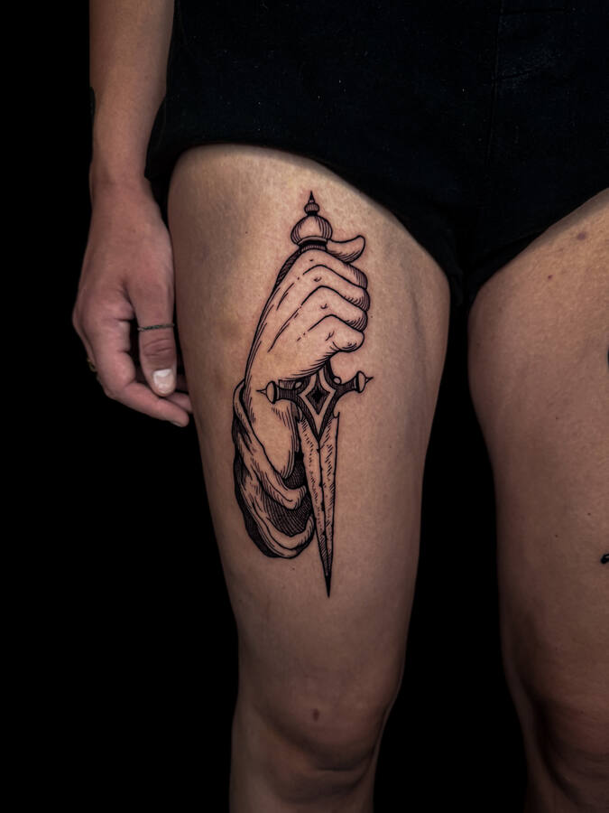

# Maxime — tatoueur

Site de Maxime, tatoueur en Suisse romande. Pages statiques, sans framework ni étape de build : on dépose le dossier tel quel chez l'hébergeur.

## Pages

| Fichier | Contenu |
| --- | --- |
| `index.html` | Accueil : le nom en très grand sur le fond animé, manifeste, pièces portées, flashs de la saison, du carnet à la peau, le studio |
| `flashs.html` | Flashs disponibles (ordre tiré au sort à chaque visite), déjà tatoués (tampon « Tatoué »), saisons passées, réserver |
| `tatouages.html` | Les pièces par thème (mains, bêtes, crânes, yeux), photos et vidéos, visionneuse plein écran |
| `processus.html` | Le carnet, l'encre, la séance, après : images et vidéos avec les mots de Maxime |
| `rendez-vous.html` | Écrire, ce qu'il faut écrire, déroulement, studio, soins, questions |
| `404.html` | Page introuvable (chemins depuis la racine : `<base href="/">`) |

## Direction

- **Fond** : brume, rayons et gravure rouge sang en WebGL (`js/fond*.js`), derrière toutes les pages. La gravure apparaît sous la souris ; sur téléphone, rien ne suit le doigt : elle reste cachée, et de temps en temps une lueur s'allume, dérive en dévoilant un morceau du dessin, puis s'éteint. D'une page à l'autre, la brume continue son chemin au lieu de repartir du noir. Quand le menu s'ouvre, la gravure entière remonte de la brume.
- **Typographie** : IM Fell English (romain, italique) et IM Fell English SC (petites capitales), licence OFL. Grands titres qui prennent toute la largeur, chiffres romains, filets fins, lettrine rouge.
- **Menu** : table des matières plein écran (`<dialog>`) ; les chapitres montent un à un, l'emblème blanc du chapitre apparaît (en haut sur téléphone, à droite sur ordinateur).

## Téléphone d'abord

Chaque disposition est d'abord pensée pour le pouce, puis élargie ; rien n'est une version d'ordinateur rétrécie. Calibré de 320 à 430 px de large, debout et à l'horizontale.

- **Barre du bas** (téléphone et tablette) : Menu à gauche, le chapitre en cours au milieu (il change en roulant), Réserver à droite ; son filet se remplit à mesure qu'on lit. Dans le menu, « Fermer » prend la place exacte de « Menu ».
- **Accueil** : la couverture tient dans l'écran, le nom posé juste au-dessus de la barre. Les pièces forment une pile de tirages : chaque photo s'arrête en haut de l'écran et la suivante vient la recouvrir.
- **Rangées à glisser** (tatouages par thème, flashs, pages du carnet, crayon → encre, pièces cicatrisées) : une œuvre par geste, la suivante dépasse pour inviter à glisser, un compteur « 2 / 5 » et un filet suivent le doigt. Dès 768 px, les mêmes œuvres redeviennent une grille éditoriale.
- **Processus** : les vidéos verticales passent en « stories » d'un bord à l'autre, la phrase de Maxime posée dessus.
- **Visionneuse** : l'œuvre grandit depuis sa vignette ; on glisse de l'une à l'autre, on la tire vers le bas pour la reposer, et elle retourne à sa place dans la rangée.
- **Retour du téléphone** : le bouton ou le geste « retour » referme le menu ou la visionneuse au lieu de quitter la page.
- **Animations** : courtes sur téléphone (on y fait défiler vite), aucune ne fait attendre le pouce ; les rangées se dévoilent d'un bloc. D'une page à l'autre, la barre du bas ne bouge pas. Zones tactiles de 44 px, marges de sécurité (encoche).
- **Tablette et ordinateur** : grille de 12 colonnes dès 768 px, avec décalages verticaux et parallaxe douce ; dès 1024 px, en-tête fixe en haut et plus de barre du bas.

## Structure

```
├── index.html · flashs.html · tatouages.html · processus.html · rendez-vous.html · 404.html
├── favicon.ico · favicon.svg · apple-touch-icon.png · site.webmanifest · robots.txt
├── css/
│   ├── styles.css        point d'entrée, importe les autres
│   ├── reset.css
│   ├── base.css          polices, couleurs, liens, boutons, mouvement réduit
│   ├── fond.css          canevas du fond animé + repli fixe sans WebGL
│   ├── entete.css        en-tête (le nom seul sur téléphone, bandeau fixe sur ordinateur)
│   ├── barre.css         barre du bas, sous le pouce (téléphone et tablette)
│   ├── menu.css          menu plein écran et ses animations
│   ├── mise-en-page.css  grille, sections, têtes de page, sommaires, révélations
│   ├── oeuvres.css       cadres, légendes, rangées à glisser, pile de tirages, planches, tampon, pensées
│   ├── accueil.css       ouverture, manifeste, bande de flashs, étapes, studio
│   ├── pages.css         fiches de flashs, registre, déroulé, stories, crayon → encre, canaux, questions, 404
│   ├── visionneuse.css   œuvres en grand
│   └── pied.css
├── js/
│   ├── main.js           point d'entrée (module)
│   ├── fond.js · fond-gl.js · fond-shader.js · fond-pointeur.js   le fond animé
│   ├── menu.js           ouverture et fermeture du menu, emblèmes
│   ├── couche.js         le « retour » du téléphone referme le menu ou la visionneuse
│   ├── entete.js         en-tête qui se retire (ordinateur), petit nom de l'accueil
│   ├── barre.js          barre du bas : chapitre en cours, filet de lecture
│   ├── defileur.js       rangées à glisser : compteur et filet
│   ├── pile.js           pile de tirages de l'accueil (téléphone)
│   ├── revele.js         apparition des images et des textes au défilement
│   ├── visionneuse.js    œuvres en grand : envol depuis la vignette, glisser, tirer vers le bas, flèches, Échap
│   ├── melange.js        ordre aléatoire des flashs disponibles
│   └── video.js          vidéos lues seulement quand elles sont à l'écran
├── assets/
│   ├── img/              photos (tt-), flashs (fl-), carnet (cn-), studio (st-), emblèmes (em-*.webp, fond transparent), icônes, image de partage
│   ├── video/            extraits MP4 de 9 s + image d'attente
│   └── fonts/            IM Fell English
└── tools/
    └── build-preview.py  version tout-en-un pour un hébergement de maquette
```

## Placer une œuvre

Chaque œuvre d'une galerie choisit sa place avec des variables en ligne :

```html
<figure class="oeuvre" style="--cd: 7 / span 3; --hd: 6rem" data-revele="image">
  <div class="cadre"></div>
  <figcaption class="legende"><span class="legende-titre">Main à la dague</span><span class="legende-lieu cap">Cuisse</span></figcaption>
</figure>
```

- Sur téléphone, la forme de la galerie décide : `galerie--defile defileur` (rangée à glisser, avec `data-defileur="Nom de la rangée"`), `galerie--pile` (pile de tirages, chaque carte avec `--n: 0, 1, 2…`), ou la grille de 6 colonnes avec `--c` (ex. `1 / span 3`) et `--h` (décalage).
- `--cd` / `--hd` : colonnes (sur 12) et décalage vertical dès 768 px.
- `--r` sur le cadre : format (`3 / 4` par défaut, `9 / 16` pour les vidéos, `1 / 1`).
- `oeuvre--plein` : l'image touche les deux bords sur téléphone. `cadre--arche` : plein cintre. `data-parallaxe` sur le cadre : léger décalage au défilement.
- Dans un bloc `data-visionneuse`, chaque œuvre s'ouvre en grand ; la légende est reprise dans la visionneuse.
- Une vidéo : `<video data-autoplay muted loop playsinline preload="none" poster="…">` avec un `aria-label`.

## Conventions

- Les vidéos sont muettes, en boucle, et ne tournent qu'à l'écran. Mouvement réduit demandé : pas d'animation, vidéos à l'arrêt, fond en image fixe.
- Les révélations ne cachent que ce qui est sous l'écran au chargement ; sans script, tout est visible.
- Le fond est plafonné (30 images/s, résolution limitée, pause quand l'onglet est caché). Sans WebGL, la gravure fixe s'affiche en CSS. Il faut servir le site en HTTP (la texture ne charge pas en `file://`).
- En-tête, barre du bas, menu et pied sont identiques sur toutes les pages : une modification se reporte dans chaque fichier HTML. Chaque chapitre porte `data-titre` (un mot court, affiché dans la barre du bas) et `data-num` (son chiffre romain).

## Lancer en local

```
python3 -m http.server 8000
```

puis ouvrir `http://localhost:8000/`.

## À compléter avant la mise en ligne

- **Instagram et e-mail de Maxime** : les liens sont marqués `data-a-completer="instagram"` et `data-a-completer="e-mail"` (menu, pied de page, page Rendez-vous). Remplacer leur `href="#"` par l'adresse du compte et par `mailto:…`.
- **Adresse du site** : une fois le domaine connu, passer `og:image` en adresse absolue (`https://…/assets/img/partage.jpg`) pour les aperçus de partage.
- Contenus à relire avec Maxime : notes de la page Processus (écrites dans sa voix), tailles et emplacements des flashs, saisons passées, date de mise à jour du catalogue.
